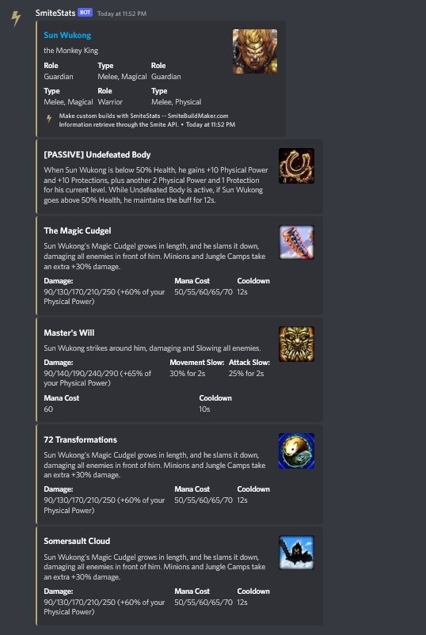

**NOTE** This bot was made prior to the Discord update requiring all bots to use slash commands. As a result, it may no longer function as intended.

---

A bot which retrieves God and Item information from _Smite_ using its API and returns it directly to your server!

Created using the Discord.js library with Node.js.

## Commands

###### _Assumes the default prefix._

`?god <god_name>` returns basic god information and ability/passive information. 
`?item <item_name>` returns item description and stats.
